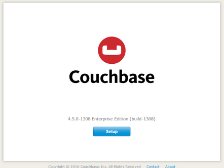
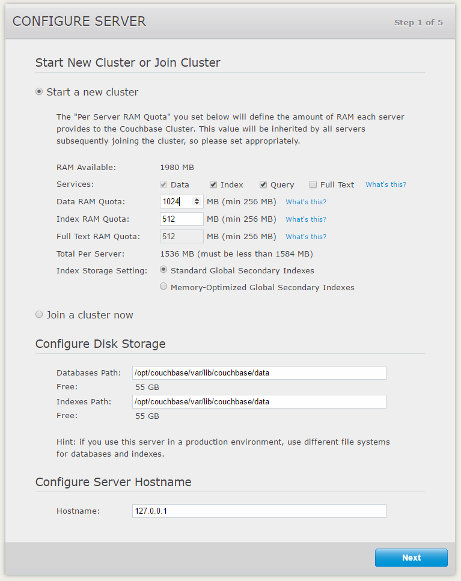
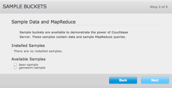
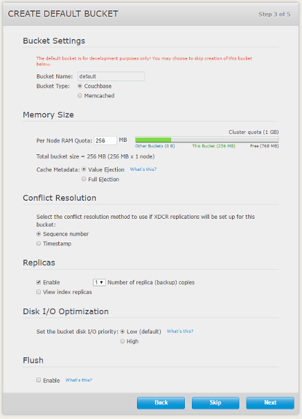
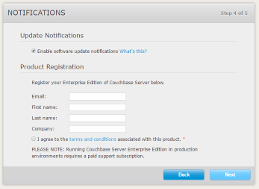
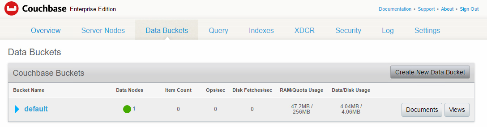
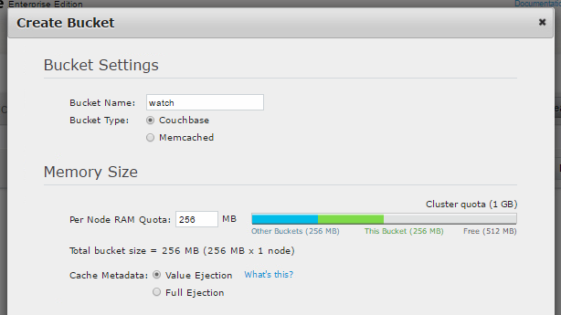
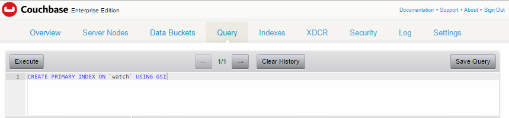
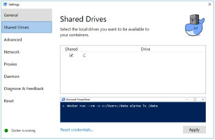

# CPR SERVER INSTALLATION GUIDE(Docker)

### 1. SYSTEM REQUIREMENTS

|           | Windows             | Linux               |
| --------- | ------------------- | :------------------ |
| CPU       | Dual Core or better | Dual Core or better |
| RAM       | 6 GB or greater     | 4 GB or greater     |
| HDD Space | 10 GB Available     | 10 GB Available     |


***


### 2. INSTALLING PREREQUISITES

#### 2.1 UBUNTU 

##### 2.1.1 INSTALL DOCKER

1. **Install using the repository**

   1. Install packages to allow apt to use a repository over HTTPS:

      **_note : '$ should not be typed or pasted in terminal_**

      ```bash
      $ sudo apt-get install \
      	apt-transport-https \
      	ca-certificates \
      	curl \
      	software-properties-common
      ```

   2. Add Docker’s official GPG key:

      ```  $ curl -fsSL https://download.docker.com/linux/ubuntu/gpg | sudo apt-key add - ```

      Verify that the key fingerprint is `9DC8 5822 9FC7 DD38 854A  E2D8 8D81 803C 0EBF CD88`

      ``` bash
      $ sudo apt-key fingerprint 0EBFCD88
      ```

   3. Use the following command to set up the stable repository. You always need the stable repository, even if you want to install edge builds as well.

      ``` shell
      $ sudo add-apt-repository \
      	"deb [arch=amd64] https://download.docker.com/linux/ubuntu \
      	$(lsb_release -cs) \
      	stable"
      ```

   4. Update the `apt` package index.

      ```  $ sudo apt-get update```

   5. install the latest version of Docker.

      ``` $ sudo apt-get install docker-ee```

      **_If the install guide does not work please refer to the link below_**

      [Get Docker for Ubuntu](https://docs.docker.com/engine/installation/linux/ubuntu/ "Docker Installation")

   2.**Install from package**

   1. Go to [https://download.docker.com/linux/ubuntu/dists/](https://download.docker.com/linux/ubuntu/dists/), choose your Ubuntu version, browse to pool/stable/, choose either amd64 or armhf,and download the .deb file for the Docker version you want to install and for your version of Ubuntu.

   2. Install Docker, changing the path below to the path where you downloaded the Docker package.

      ```shell
      $ sudo dpkg -i /path/to/package.deb
      ```

   3. Verify that Docker CE is installed correctly by running the hello-world image.

      ```shell
      $ sudo docker run hello-world
      ```

      This command downloads a test image and runs it in a container. When the container runs, it prints an informational message and exits.

##### 2.1.2 INSTALL NGINX

Commands to install NGINX:

* ```$ sudo apt-get update```

* ```$ sudo apt-get install nginx```

  _*If the above commands do not work then use the commands below:_

```shell
$ sudo -s
nginx=stable # use nginx=development for latest development version
add-apt-repository ppa:nginx/$nginx
apt-get update
apt-get install nginx
```

If you get an error about add-apt-repository not existing, you will want to install **python-software-properties**

```shell
$ sudo -s
nginx=stable # use nginx=development for latest development version
echo "deb http://ppa.launchpad.net/nginx/$nginx/ubuntu lucid main" > /etc/apt/sources.list.d/nginx-$nginx-lucid.list
apt-key adv --keyserver keyserver.ubuntu.com --recv-keys C300EE8C
apt-get update
apt-get install nginx
```

#### 2.2 WINDOWS 

##### 2.2.1 INSTALL DOCKER

Download Docker Installer for windows and install.

​	https://download.docker.com/win/stable/InstallDocker.msi

[_*Docker Install guide_](https://docs.docker.com/docker-for-windows/install/)

##### 2.2.2 INSTALL NGINX

1. Download latest Stable Nginx version for windows from

   ​	https://nginx.org/en/download.html 

2. Extract the zip archive onto your windows system

   * -This guide will use [C:\nginx-1.12.0](file:///C:/nginx-1.12.0), but you can substitute this with your own file path.

***


### 3. INSTALLING DATABASE (WINDOWS AND UBUNTU)

1. Pull docker image for couchbase server (Use Command Prompt in windows)

   ``` $ docker pull couchbase/server```

2. Create an internal network for couchbase 

```shell
$ docker network create --driver bridge couchbase
```

3. Start the docker container with the given parameters

```shell
$ docker run --net=couchbase --name couchbase-server -p 8091-8094:8091-8094 -p 11210:11210 -d couchbase/server
```

4. Check if the container is running with the command 

   `$ docker ps`

##### 3.1 SETUP DATABASE

1. Open Couchbase Web Console on http:/server_ip_address:8091. 



2. Set up the disk storage and cluster configuration. 

   * The  _Configure Disk Storage_  option specifies the location of the persistent storage used by the Couchbase Server.
   * The  _Configure Server Memory_ section sets the amount of physical RAM that will be allocated by the Couchbase Server for storage. 

3. Start a new cluster with at least 512 MB RAM (1024 MB Recommended)

   * Enter the Data RAM Quota : 1024
   * Enter Index RAM Quota: 512

   

4. Do not create any sample buckets

   

5. Create  _default_ bucket with 256 MB RAM for development purposes

   * Enter per node RAM Quota

   

6. Agree to the terms and conditions (Product registration is not mandatory)

   

7. Create User Account for Administrator

   

8. Goto _Data Buckets_ tab on the couchbase dashboard.

   

9. Create a bucket named _watch_ with 256 MB RAM Quota.

   * Enter Bucket Name : watch
   * Enter per Node RAM Quota : 256 MB

   

10. Goto the Query Tab

  

  * Type the command ```CREATE PRIMARY INDEX ON `watch` USING GSI```
  * Click on the Execute Button to execute the command

***


### 4. INSTALLING SYNC GATEWAY

Download Sync Gateway (Windows and Ubuntu):

``` $ docker pull couchbase/sync-gateway```

##### 4.1 CONFIGURE SYNC GATEWAY

##### 4.1.1 UBUNTU

1. Create a config file in `/tmp/` and name it  "_sync_gw_config.json_". 

```json
{
  "log": ["*"],
  "databases": {
    "watch_db": {
      "server": "http://couchbase-server:8091",
      "bucket": "watch",
      "users": { 
		"GUEST": { "disabled": false, "admin_channels": ["*"] },
		"admin": {"password": "mlgadmin", "admin_roles": ["admin"]},
		"cpr": {"password": "password"}
		}
    }
  }
}
```

2. Create and run a docker container for the sync-gateway using the command

   ```shell
   $ docker run --net=couchbase --name couchbase-sync -p 4984-4985:4984-4985 -v /tmp:/tmp/config -d couchbase/sync-gateway /tmp/config/sync_gw_config.json 
   ```


##### 4.1.2 WINDOWS

​	1.Create a config file on your system called **_sync_gw_config.json_** in the directory [C:\sync_gateway](c:\sync_gateway) (Create 	the directory)

​	the file path should look like  **_C:\sync_gateway\sync_gw_config.json_** 

The contents of the config file should be

```json
{
  "log": ["*"],
  "databases": {
    "watch_db": {
      "server": "http://couchbase-server:8091",
      "bucket": "watch",
      "users": { 
		"GUEST": { "disabled": false, "admin_channels": ["*"] },
		"admin": {"password": "mlgadmin", "admin_roles": ["admin"]},
		"cpr": {"password": "password"}
		}
    }
  }
}
```

2. In Docker for Windows Settings share the drive C with docker:

   

3. Run a  docker container for sync gateway.

```shell
$ docker run –-net=couchbase --name couchbase-sync -p 4984-4985:4984-4985 -v //c/sync_gateway/:/tmp/config -d couchbase/sync_gateway /tmp/config/sync_gw_config.json
```

***

##### 4.2 TEST SYNC GATEWAY

1. Enter the URL http://server_ip_address:4984 in the browser, it should print a JSON file on the screen.

### 5. INSTALLING WEB PORTAL

1. Move to the directory containing the web portal source code

2. Create a "_.dockerignore_" file with the following contents

   ```
   node_modules
   npm-debug.log
   ```

3. Build docker image  (**Execute all docker commands as sudo**)

   ```shell
   $ docker build -t node-web-app .
   ```

4. Run the image using the command

   ```shell
   $ docker run --net=couchbase --name portal -p 5000:5000 -d node-web-app 
   ```

***


### 6. CONFIGURE NGINX AS REVERSE PROXY

##### 6.1 UBUNTU

1. Edit the _default_ NGINX config file at `/etc/nginx/sites-available`

2. Copy and paste the text below

   ```json
   server {
   	listen 80 default_server;
   	listen [::]:80 default_server;

   	root /var/www/html;
     
   	# Add index.php to the list if you are using PHP
   	index index.html index.htm index.nginx-debian.html;

   	server_name _;
   	location / {
   		proxy_pass http://127.0.0.1:5000;
           proxy_pass_header	Accept;
   		proxy_pass_header	Server;
   		proxy_http_version	1.1;
   		keepalive_requests	100;
   		keepalive_timeout	360s;
   		proxy_read_timeout	360s;
   	}
   }

   ```

   This redirects all the requests to port 80 to port 5000.

   ​


##### 6.2 WINDOWS

1. Edit the _default_ nginx config file at `C:\nginx-1.12.0\conf\nginx.conf`

   *_note the version of nginx may vary_

2. Copy and paste the text below

   ```json
   server {
   		listen 80 default_server ;
   		listen [::]:80 default_server ;
   	
   		root html;

   		index index.html;

   		server_name _;
   		location / {
   			proxy_pass http://127.0.0.1:5000;
   			proxy_pass_header Accept;
   			proxy_pass_header Server;
   			proxy_http_version 1.1;
   			keepalive_requests 100;
   			keepalive_timeout 360s;
   			proxy_read_timeout 360s;
   		}
   	}
   ```

3. Run nginx by double clicking _nginx.exe_ icon in `C:\nginx-1.12.0\`

4. Check that nginx is working by going to the task manager

### WINDOWS FIREWALL (FOR WINDOWS SYSTEMS ONLY)

1. Make sure that the ports 4984, 4985, 5000, 8091, 8092 are not blocked by the firewall.

### 7. RESTARTING  DOCKER CONTAINERS ON SYSTEM REBOOT

```shell
$ docker start couchbase-server
$ docker start couchbase-sync
$ docker start portal
```

